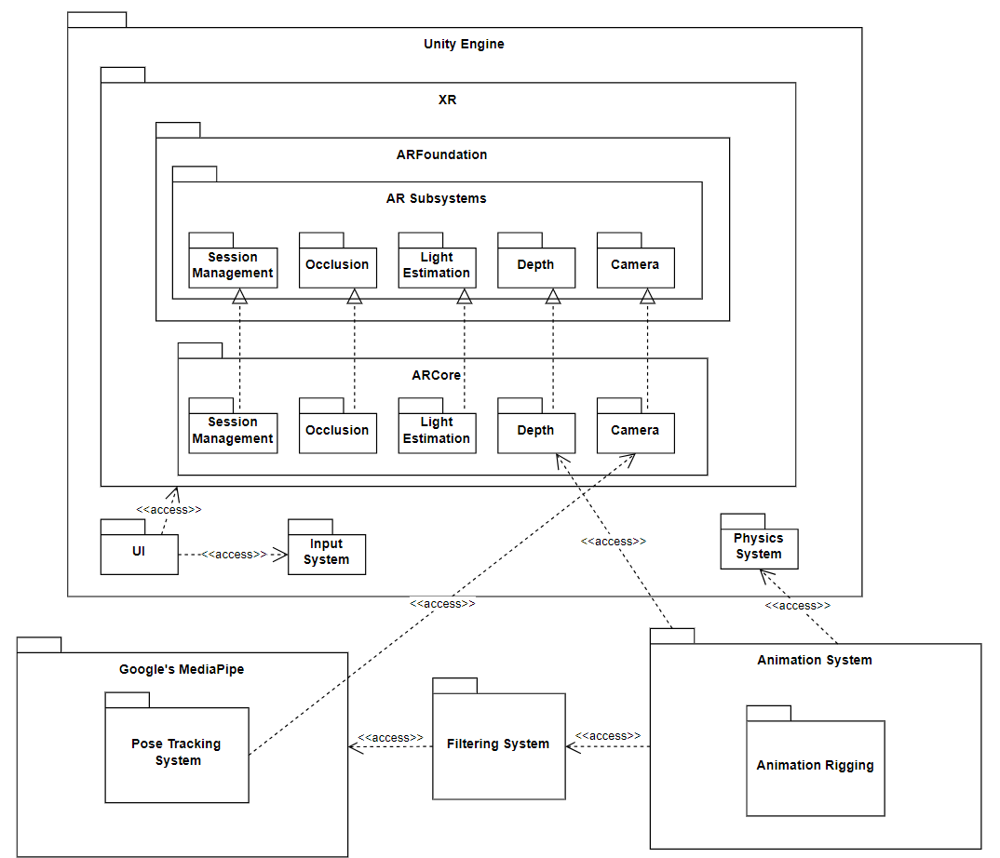
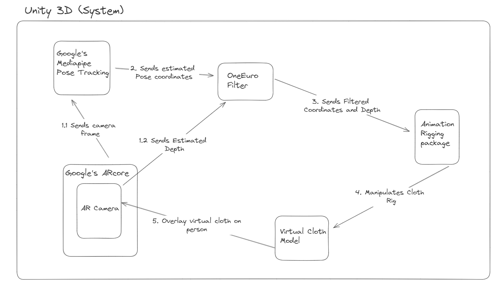
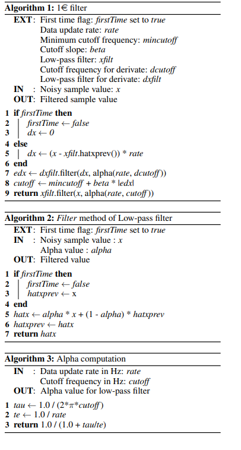
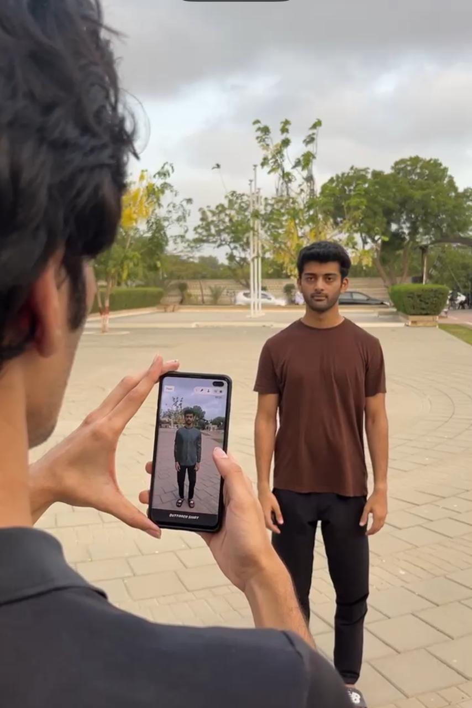

# AR Virtual Try-on With Sensorless Depth Perception

The main aim of the project was to make use of AR, concepts from robotics and depth estimation without a sensor to bring innovative fashion tech to users with as little resources in terms of computaional power on their mobile devices as possible

By leveraging 3D models and camera input, users can visualize how various garments will look on them with movements in real time, ultimately enhancing their online shopping experience.
## Package Diagram

## System Diagram

## Algorithm

## Software Demo Video Link

